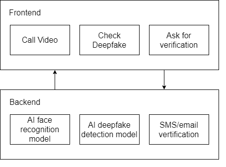
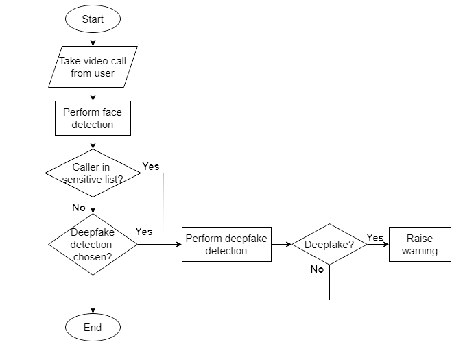

# Anti-Deepfake Video Call

A product made in a two-day Digital Security Hackathon to enhance awareness and mitigate risks related to cybersecurity in the digital space.

## Description

This is a real-time Deepfake detection mobile application that protects users from the risk of Deepfake fraud when participating in
online video calls.

## Overview

### Target users

* Elderly people who are vulnerable to the risk of deepfake fraud via video call.
* Organizations which need high confidentiality in video call, for example in case of video banking.

### Idea

* Using Machine Learning model, the application can update the list of trustworthy people of users.
* When users make a phone call, the system will check if the person on the other side is in trustworthy list or not. If yes, it will automatically detect deepfake and raise warning to users. Otherwise, users can press the deepfake detection button on the screen if necessary.
* Users can send vertification to the other side by email if they want to confirm if that person is truly calling or not.

### System design

### Deepfake detection flow

### Technology used

* Frontend: Android Studio
* Backend: Flask
* AI model: Teachable Machine, Ultralytics YOLOv8
